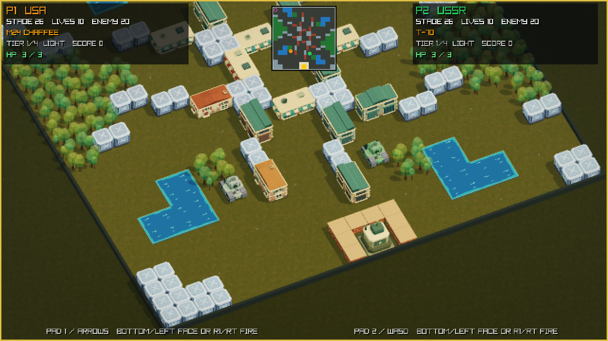
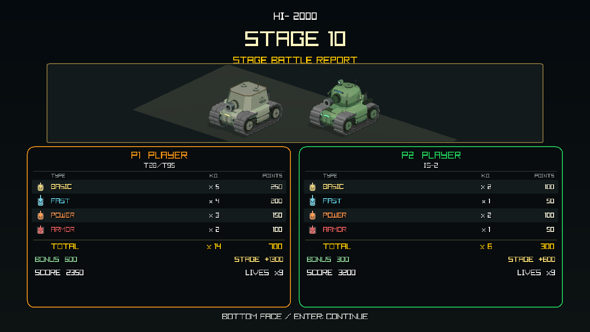
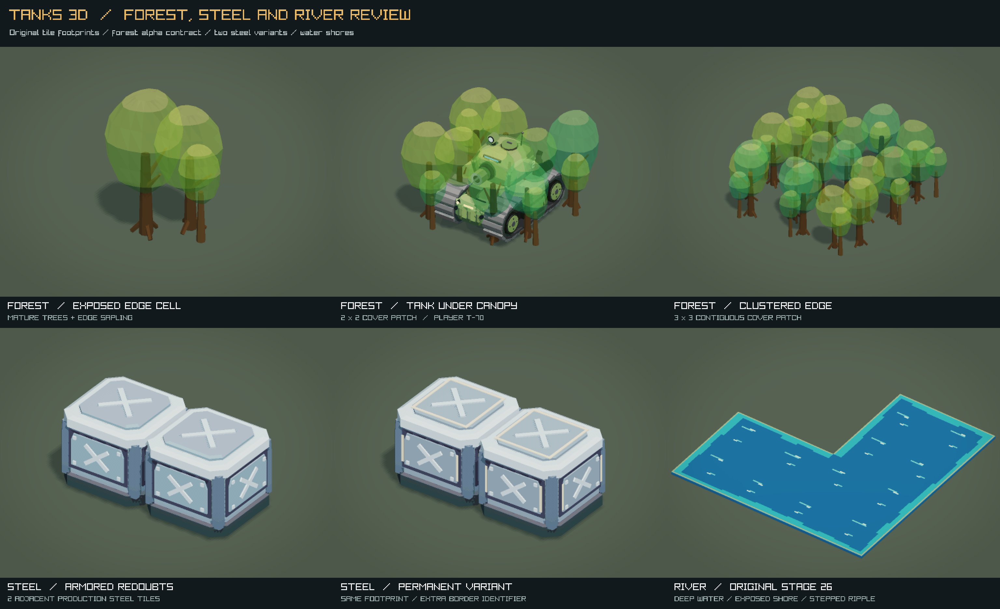

# Tanks 3D

Arcade tank combat on destructible 3D battlefields for macOS. Defend your
headquarters, upgrade through three national tank lines, and play solo or
local co-op across the 35 original Battle City battlefield layouts.

## Current development preview

**These screenshots show the current source build.** Rebuilt tanks and
terrain, layered battle effects, a subtle pixel finish, a wider adjustable
camera and the restored Battle City maps are newer than
the downloadable Alpha 4 release. [Build the current version](#build-and-play-current-version)
to play with the visuals shown here.



*Original stage 26 at 50° elevation and 25° left rotation, with staged tank
positions for the visual review. Rendered by the game with the wider camera.*

## Highlights

- Chunky arcade machinery with continuous tracks, layered armor, distinctive
  rounded cabins and painted materials, inspired by the military adventure art of
  1990s arcade games.
- 12 player tanks across United States, Soviet and German light-to-super-heavy
  lines, plus four enemy roles.
- Destructible buildings with tiled roofs, shop awnings and exposed ruins;
  three national headquarters, rounded forest canopies, shaded riverbanks and
  clearly marked steel barriers.
- All 35 original Battle City maps in their original order, with full-map
  radar, nine pickups, upgrades, HP, streaks and shell cancellation.
- Subtle pixel edges on the 3D scene, with crisp HUD text; short shell tracers,
  layered orange fire and rolling smoke distinguish combat effects.
- A 19% wider default view, with adjustable rotation (-45° to +45°) and
  elevation (40° to 70°). Local co-op shares a camera that follows both players.



*Battle-report preview using the game's built-in showcase. Tank geometry is
original procedural work; see the [art direction](docs/ART_DIRECTION.md).*



*Forest cover, ordinary and permanent steel, and river shores at detail scale.
Permanent steel has an additional pale gold frame; gameplay damage rules are
unchanged.*

[View a current single-player screenshot](build/release-evidence/battlefield-art-20260909/gameplay-solo.png)
· [Visual review and screenshot sources](build/release-evidence/battlefield-art-20260909/README.md)
· [Tank proportion comparison](build/release-evidence/main-showcase-20260909/tank-proportions.png)

## Build and play current version

On macOS, with Homebrew and the Xcode Command Line Tools installed:

```sh
git clone https://github.com/tourzhao/Tanks3D.git
cd Tanks3D
brew install raylib
make run-app
```

The project uses C++17 and raylib 6.0. `make run-app` builds and opens
`build/Tanks3D.app`; `make run` starts the executable in the terminal. See the
[development guide](docs/DEVELOPMENT.md) for prerequisites, tests and project layout.

## Download Alpha 4

**[Download Tanks 3D Alpha 4 for Apple Silicon](https://github.com/tourzhao/Tanks3D/releases/download/v0.1.0-alpha.4/Tanks3D-0.1.0-alpha.4-macos-arm64-macos26.0.zip)**

This published build predates the current visual and camera upgrades. For its
original screenshots and features, see the [Alpha 4 release notes](docs/releases/v0.1.0-alpha.4.md).

Requires **macOS 26.0 or later**. Extract the ZIP, right-click `Tanks3D.app`,
and choose **Open**. If macOS blocks it, use
**System Settings > Privacy & Security > Open Anyway**.

Alpha 4 is an early pre-release and is not Apple notarized.

## Controls in the current version

- **P1:** Arrow keys; `Space`/Right Option/Right Control fires.
- **P2:** `WASD`; `F`/Left Option/Left Control fires.
- **Controller:** In battle, the left stick follows the visible map lanes at
  the selected camera angle. The D-pad and keyboard retain one button per
  world-cardinal lane; menu input is unrotated. `B`/`Y`/`R`/`ZR` fires;
  `+` starts or pauses; `-` returns. ABXY never exits the game.
- `Enter` pauses · `Esc` returns to setup · `R` restarts.
- **Advanced Settings:** `View Horizontal` and `View Elevation` adjust the
  camera. Default: 0° horizontal, 50° elevation.

## More

[Report a bug](https://github.com/tourzhao/Tanks3D/issues) ·
[Development guide](docs/DEVELOPMENT.md) ·
[Art direction](docs/ART_DIRECTION.md) ·
[Map sources and verification](docs/BATTLE_CITY_MAPS.md) ·
[License](LICENSE) · [Third-party notices](THIRD_PARTY_NOTICES.md)

Independent, non-commercial fan project. Not affiliated with or endorsed by
any game publisher, vehicle manufacturer, government, or other rights holder.
