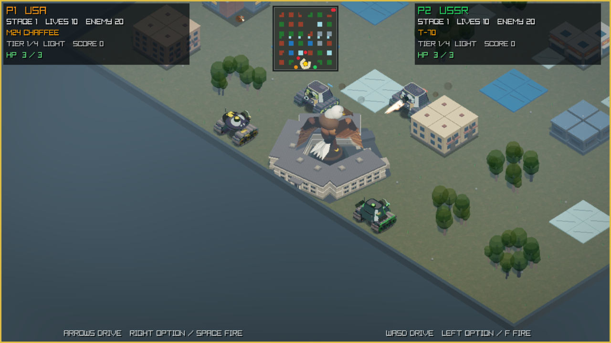
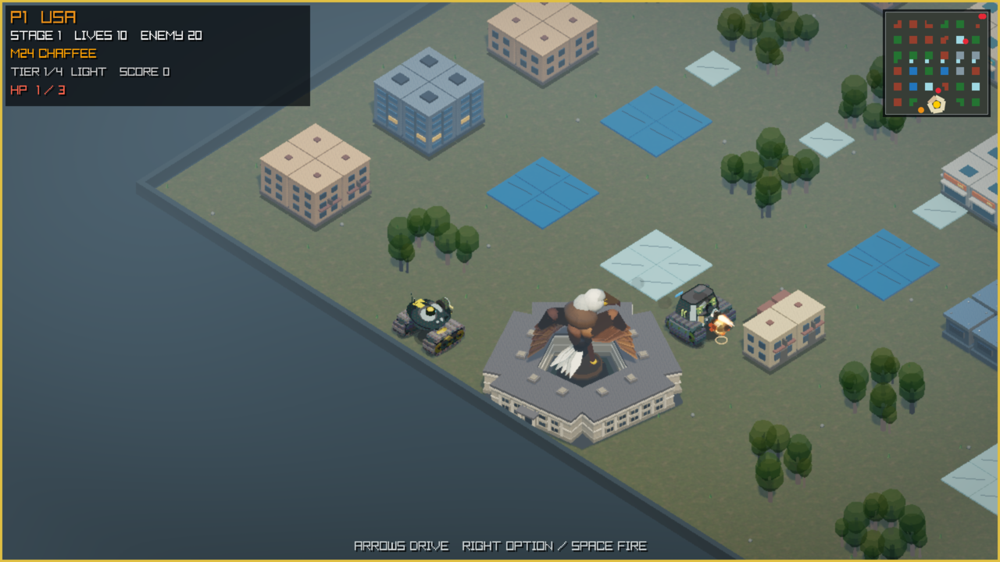

# Tanks 3D

Classic four-direction tank combat rebuilt with a tilted 3D battlefield view.
Select both its horizontal rotation and top-down elevation.
Play solo or local co-op across 35 destructible stages.
The adjustable view is currently in the source build and will ship after
Alpha 4.

## Download

**[Download Tanks 3D Alpha 4 for Apple Silicon](https://github.com/tourzhao/Tanks3D/releases/download/v0.1.0-alpha.4/Tanks3D-0.1.0-alpha.4-macos-arm64-macos26.0.zip)**

Requires **macOS 26.0 or later**. Extract the ZIP, right-click `Tanks3D.app`,
and choose **Open**. If macOS blocks it, use
**System Settings > Privacy & Security > Open Anyway**.

Alpha 4 is an early pre-release and is not Apple notarized.

## Highlights

- Destructible battlefields, national bases, and full-map radar.
- United States, Soviet, and German light-to-super-heavy tank lines.
- Nine pickups, upgrades, HP, streaks, shell cancellation, and battle reports.
- Adjustable camera rotation (-45° to +45°) and elevation (40° to 70°) in
  5-degree steps (source build; next release).

## Controls

- **P1:** Arrow keys; `Space`/Right Option/Right Control fires.
- **P2:** `WASD`; `F`/Left Option/Left Control fires.
- **Controller (source build; next release):** In battle, the left stick
  follows the visible map lanes at the selected camera angle. The D-pad and
  keyboard retain one button per world-cardinal lane; menu input is unrotated.
  `B`/`Y`/`R`/`ZR` fires; `+` starts or pauses; `-` returns. ABXY never exits
  the game.
- `Enter` pauses · `Esc` returns to setup · `R` restarts.

## More

[Report a bug](https://github.com/tourzhao/Tanks3D/issues) ·
[Development guide](docs/DEVELOPMENT.md) · [License](LICENSE) ·
[Third-party notices](THIRD_PARTY_NOTICES.md)

Independent, non-commercial fan project. Not affiliated with or endorsed by
any game publisher, vehicle manufacturer, government, or other rights holder.
