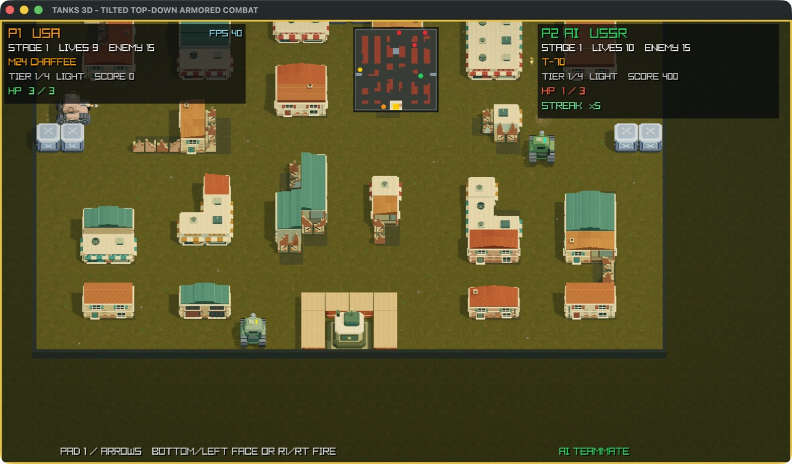
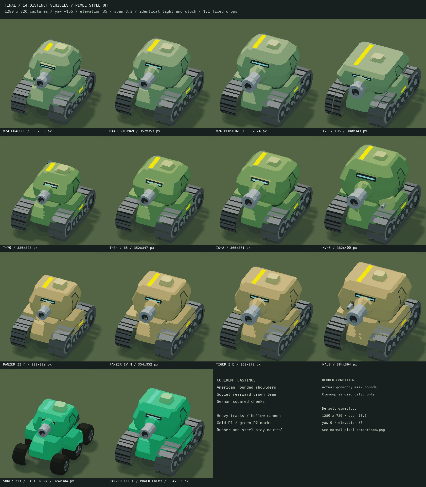
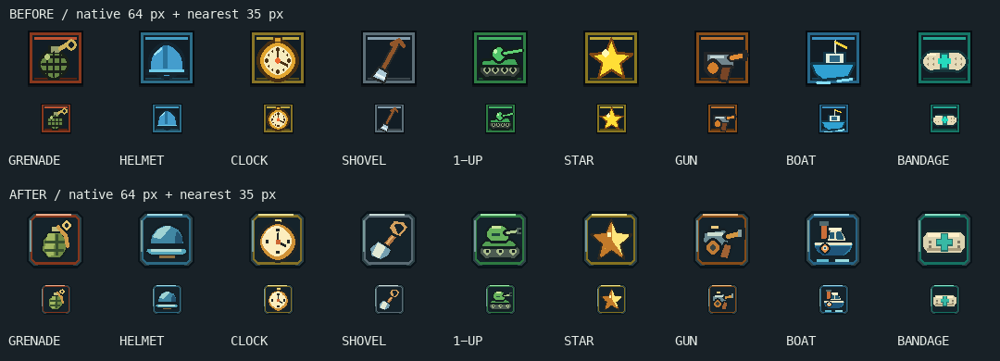

# Tanks 3D

Arcade tank combat on destructible 3D battlefields for macOS. Defend your
headquarters, upgrade through three national tank lines, and play solo, with an
AI teammate, or in local/LAN co-op across the 35 original Battle City layouts.

## Current development preview

**These images show the current development source.** The unified arcade tank
roster, redesigned pickup badges, LAN play and native rule-based AI teammate
are available when you [build the current version](#build-and-play-current-version).
They are not included in the published Alpha 4 download.



*Normal shared game camera. P2 moves and fires autonomously; the right HUD
identifies the AI teammate. Original 1280×720 game content with the window title
bar retained. Select PLAYERS → AI AS P2 to try it.*

Development tests and packaging checks pass; physical controller, human/AI,
clean-Mac and long-session release acceptance remain pending. See the
[development review](build/release-evidence/github-preview-20260915/README.md)
and [historical Alpha 5 candidate notes](docs/releases/v0.1.0-alpha.5.md).

## Highlights

- Chunky arcade machinery with continuous tracks, layered armor, distinctive
  rounded cabins and painted materials, inspired by the military adventure art of
  1990s arcade games.
- 12 player tanks across United States, Soviet and German light-to-super-heavy
  lines, plus four enemy roles. Enemy vehicles come from the nations not chosen
  by participating players: two opposing nations in solo or same-nation co-op,
  and the remaining nation when co-op players choose different nations.
- Destructible buildings with tiled roofs, shop awnings and exposed ruins;
  three national headquarters, rounded forest canopies, shaded riverbanks and
  clearly marked steel barriers.
- All 35 original Battle City maps in their original order, with full-map
  radar, nine pickups, upgrades, HP, streaks and shell cancellation.
- Optional AI P2 uses tactical rules at 20 Hz without a model or Python runtime;
  local and LAN modes also support two human players.
- Optional crisp pixel edges on the 3D scene, with sharp HUD text; short shell tracers,
  layered orange fire and rolling smoke distinguish combat effects.
- A 19% wider default view, with adjustable rotation (-45° to +45°) and
  elevation (40° to 70°). Local co-op shares a camera that follows both players.
- Battle City stage-start and game-over cues from JustoSenka/BattleCity;
  battle audio uses engine sounds and effects without looping background music
  ([audio sources](ASSET_LICENSES.md#runtime-audio)).



*Diagnostic close-ups with fixed crops and identical camera/light settings;
this sheet is for comparing models, not their normal gameplay size. Geometry
is original procedural work; see the [art direction](docs/ART_DIRECTION.md).*



*Top: previous badges. Bottom: redesigned badges at native 64 px and 35 px.
Boat now uses a connected tug hull, wheelhouse, funnel and life ring.*

[Image sources, capture conditions and validation](build/release-evidence/github-preview-20260915/README.md)

## Build and play current version

On macOS, with Homebrew and the Xcode Command Line Tools installed:

```sh
git clone https://github.com/tourzhao/Tanks3D.git
cd Tanks3D
brew install raylib
make run-app
```

The project uses C++17 and raylib 6.0. `make run-app` builds and opens
`build/Tanks3D.app`; `make run` starts the executable in the terminal. See the
[development guide](docs/DEVELOPMENT.md) for prerequisites, tests and project layout.

## Play with an AI teammate

In the main menu, use Left/Right on **PLAYERS** to select **AI AS P2**, then
press Enter to start. You control P1 with the usual keyboard or controller;
P2 moves and fires automatically. Its nation is selectable under **P2 NATION**.
Choose **1 PLAYER** for solo play or **2 PLAYERS** for two human players.

The teammate uses the selected tactical rules in native C++, with 20 decisions
per second and no Python, model download or ML runtime. It uses the normal
two-player rules, lives and upgrades. This source-build feature is not included
in the published Alpha 4 download; human cooperation is still being evaluated.

## Train an AI player

The source tree includes optional tools for training a player with imitation
learning and PPO on the real headless C++ game, comparing it with scripted and
random baselines, and watching its actions in the normal 3D renderer.
See [AI training and evaluation](docs/AI_TRAINING.md). This is a development
workflow, not a trained opponent bundled in the published download.

## Play over a local network

Build the current source and use the same `Tanks3D.app` on both Macs. Choose
**LOCAL NETWORK → CREATE ROOM** on one computer, then enter its displayed
IPv4 address under **LOCAL NETWORK → HOST IP** on the other. Each computer
controls one tank; the host is P1 and the guest is P2. The existing two-player
co-op rules and shared battlefield remain in use.

[LAN setup, controls and connection troubleshooting](docs/LAN_PLAY.md).
This feature is not included in the published Alpha 4 build.

## Download Alpha 4

**[Download Tanks 3D Alpha 4 for Apple Silicon](https://github.com/tourzhao/Tanks3D/releases/download/v0.1.0-alpha.4/Tanks3D-0.1.0-alpha.4-macos-arm64-macos26.0.zip)**

This published build predates the current visual and camera upgrades. For its
original screenshots and features, see the [Alpha 4 release notes](docs/releases/v0.1.0-alpha.4.md).

Requires **macOS 26.0 or later**. Extract the ZIP, right-click `Tanks3D.app`,
and choose **Open**. If macOS blocks it, use
**System Settings > Privacy & Security > Open Anyway**.

Alpha 4 is an early pre-release and is not Apple notarized.

## Controls in the current version

- **P1:** Arrow keys; `Space`/Right Option/Right Control fires.
- **P2 (human mode):** `WASD`; `F`/Left Option/Left Control fires.
- **AI AS P2:** Only P1 needs input; either connected controller can control P1.
  The right HUD identifies P2 as **AI TEAMMATE**.
- **Controller:** In battle, the left stick follows the visible map lanes at
  the selected camera angle. The D-pad and keyboard retain one button per
  world-cardinal lane; menu input is unrotated. `B`/`Y`/`R`/`ZR` fires;
  `+` starts or pauses; `-` returns. ABXY never exits the game.
- `Enter` pauses · `Esc` returns to setup · `R` restarts.
- **Advanced Settings:** `View Horizontal` and `View Elevation` adjust the
  camera. Default: 0° horizontal, 50° elevation. `Pixel Style` toggles the
  optional pixel treatment (default OFF); left/right or confirm changes it.

## More

[Report a bug](https://github.com/tourzhao/Tanks3D/issues) ·
[Development guide](docs/DEVELOPMENT.md) ·
[Art direction](docs/ART_DIRECTION.md) ·
[Map sources and verification](docs/BATTLE_CITY_MAPS.md) ·
[License](LICENSE) · [Third-party notices](THIRD_PARTY_NOTICES.md)

Independent, non-commercial fan project. Not affiliated with or endorsed by
any game publisher, vehicle manufacturer, government, or other rights holder.
