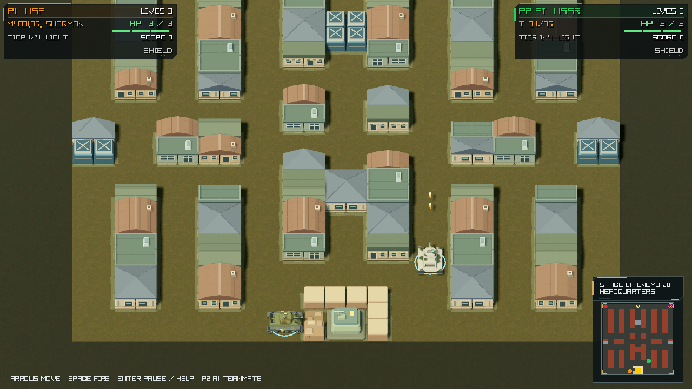
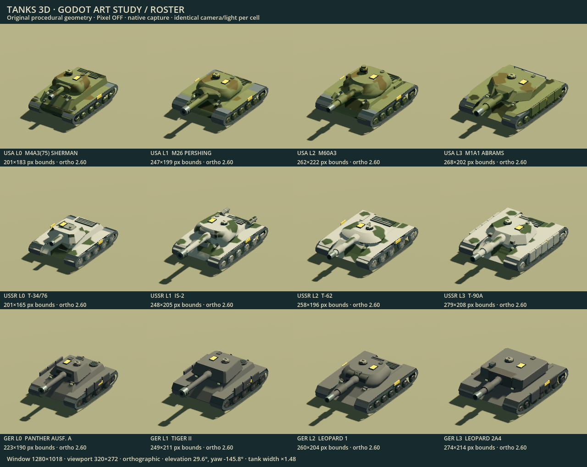
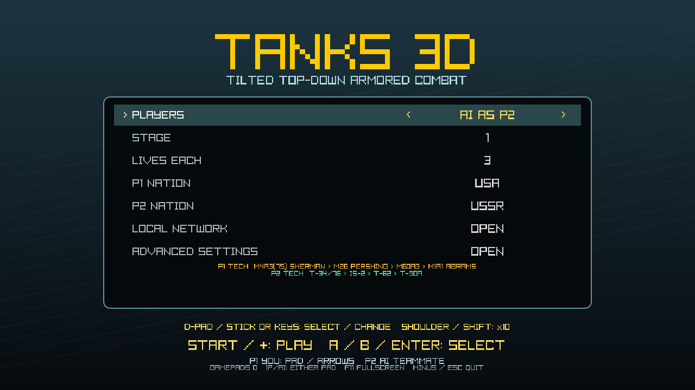

# Tanks 3D

Arcade tank combat on destructible 3D battlefields for macOS. Defend your
headquarters, upgrade through three national tank lines, and play solo, with an
AI teammate, or in local/LAN co-op across the 35 original Battle City layouts.

**The current game uses Godot with native Metal rendering and a shared C++
gameplay, AI and networking core.** It is still in development and available by
[building from source](#build-and-play-current-version). The published
[Alpha 4 download](#download-alpha-4) is the older raylib version; it does not
contain the Godot features and visuals shown here.

## October 6 development preview



*Actual Metal gameplay rendering at 1280×720, with Pixel Style OFF and the
default camera (0° horizontal, 50° elevation). See the
[capture details](build/release-evidence/github-preview-20261006/README.md).*

## Highlights

- **12 player tanks** across American, Soviet and German upgrade lines, with
  distinct hulls, turrets, running gear and camouflage, plus four enemy roles.
- **35 Battle City maps** in their original order: defend your headquarters,
  break through buildings, collect nine kinds of pickups and follow the radar.
- **Solo, AI teammate, local co-op and LAN co-op.** Two players share a camera
  that follows both tanks; rotation and elevation are adjustable.
- **Refined lighting and surfaces:** clearer shadows, continuous highlights
  around gun barrels, and distinct responses for painted armor, metal and rubber.
- **Window-adaptive rendering up to 1920×1080.** Optional Pixel Style gives the
  scene a retro treatment with a 1280×720 ceiling, while HUD text stays sharp.
- Shell tracers, fire, smoke and engine sounds bring battles to life, with
  Battle City stage-start and game-over cues
  ([audio sources](ASSET_LICENSES.md#runtime-audio)).



*Close-up model comparisons under shared camera and lighting settings; tanks
appear smaller during normal play. See the [art direction](docs/ART_DIRECTION.md)
and [Godot modeling notes](docs/GODOT_ART.md).*



*Choose your crew, national lines and starting stage, or open LAN and advanced
settings from the deployment menu.*

## Build and play current version

On an Apple Silicon Mac, install Xcode Command Line Tools and Python 3.9 or later:

```sh
git clone https://github.com/tourzhao/Tanks3D.git
cd Tanks3D
make godot-setup
make run-godot-app
```

`godot-setup` downloads free, hash-pinned tools into `build/godot-tools`.
`make run-godot-app` builds and opens `build/Tanks3D-Godot.app`; `make run-godot`
runs the staged project from the terminal. The Godot game builds without raylib
and targets Apple Silicon with macOS 13+ and Metal. Development builds have been
tested on M2 and M5 Pro Macs; this is not a performance or compatibility guarantee
for every supported Mac or macOS version. See the [Godot guide](docs/GODOT_SAMPLE.md).

The ordinary app is a local development build. Distributable Godot candidates
use the separate [candidate and release verification workflow](docs/GODOT_RELEASE.md),
including package verification and candidate-specific human and hardware QA.
Development checks do not establish release acceptance.
The historical `make`, `make run` and `make run-app` commands still select raylib;
use the explicit Godot commands above for current development.

## Choose how to play

- **Solo or local co-op:** Use Left/Right on **PLAYERS** to choose **1 PLAYER**
  or **2 PLAYERS**, select your nations, then press Enter to start.
- **AI teammate:** Select **AI AS P2** and choose its nation under **P2 NATION**.
  You control P1; P2 moves and fires automatically using native C++ tactical
  rules at 20 decisions per second. No model download or Python runtime is needed.
- **LAN co-op:** Use the same current `Tanks3D-Godot.app` on both Macs. Choose
  **LOCAL NETWORK → CREATE ROOM** on the host, then enter its displayed IPv4
  address under **LOCAL NETWORK → HOST IP** on the guest and join. The host
  controls P1; the guest controls P2. Both use P1 controls for their local tank.
  See the [LAN guide](docs/LAN_PLAY.md).

For developers, optional [AI training and evaluation tools](docs/AI_TRAINING.md)
run imitation learning and PPO against the headless C++ game. These are separate
from the rule-based teammate included in normal play.

## Download Alpha 4

**[Download Tanks 3D Alpha 4 for Apple Silicon](https://github.com/tourzhao/Tanks3D/releases/download/v0.1.0-alpha.4/Tanks3D-0.1.0-alpha.4-macos-arm64-macos26.0.zip)**

This is the historical **raylib** build, retained alongside its source. For its
screenshots and features, see the [Alpha 4 release notes](docs/releases/v0.1.0-alpha.4.md).

Requires **macOS 26.0 or later**. Extract the ZIP, right-click `Tanks3D.app`,
and choose **Open**. If macOS blocks it, use
**System Settings > Privacy & Security > Open Anyway**.

Alpha 4 is an early pre-release and is not Apple notarized.

## Controls in the current version

- **P1:** Arrow keys; `Space`/Right Option/Right Control fires.
- **P2 (human mode):** `WASD`; `F`/Left Option/Left Control fires.
- **AI AS P2:** Only P1 needs input; either connected controller can control P1.
  The right HUD identifies P2 as **AI TEAMMATE**.
- **Controller:** In battle, the left stick follows the visible map lanes at
  the selected camera angle. The D-pad and keyboard retain one button per
  world-cardinal lane; menu input is unrotated. With Switch-style button labels,
  `B`/`Y`/`R`/`ZR` fires; `+` starts or pauses; `-` returns.
- `Enter` pauses · `Esc` returns to setup · `R` restarts (LAN host only) ·
  `F11` toggles fullscreen.
- **Advanced Settings:** `View Horizontal` and `View Elevation` adjust the
  camera. Default: 0° horizontal, 50° elevation. `Pixel Style` toggles the
  optional pixel treatment (default OFF); left/right or confirm changes it.

## More

[Report a bug](https://github.com/tourzhao/Tanks3D/issues) ·
[Development guide](docs/DEVELOPMENT.md) ·
[Architecture](docs/ARCHITECTURE.md) ·
[Art direction](docs/ART_DIRECTION.md) ·
[Map sources and verification](docs/BATTLE_CITY_MAPS.md) ·
[License](LICENSE) · [Asset licenses](ASSET_LICENSES.md) ·
[Third-party notices](THIRD_PARTY_NOTICES.md)

Independent, non-commercial fan project. Not affiliated with or endorsed by
any game publisher, vehicle manufacturer, government, or other rights holder.
