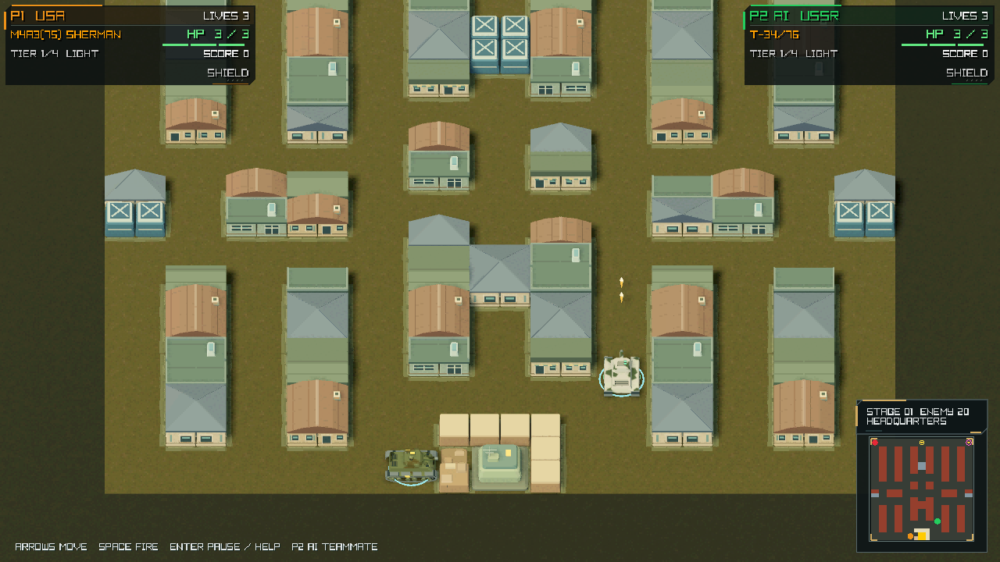
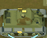
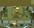

# September 29 Godot preview

These are actual Mobile / Metal renders on Apple M2, without retouching or
substituted concept art. They document the active Godot frontend, not a published
release or human/hardware QA approval. The [capture manifest](capture-manifest.json)
records source and image hashes. The September 15 raylib captures remain intact.

## Gameplay




Window and internal render: 1280×720. Stage 1, seed 20260916, frame 300,
default yaw 0°, elevation 50°, orthographic span 18.5. P1 uses the deterministic
movement/fire tape; P2 is the native AI. Audio is disabled in this demo.
The paired images freeze simulation between captures. [State and camera](game/capture.json).
P1's original-size bounds are 68×55 px; crops are not enlarged:




Reproduce after `make godot-sample`:

```sh
build/godot-tools/Godot.app/Contents/MacOS/Godot \
  --path build/godot/project --rendering-method mobile --rendering-driver metal \
  --resolution 1280x720 -- --demo --stage=1 --seed=20260916 --frames=360 \
  --capture-at=300 --capture="$PWD/build/godot/new-preview"
```

## Vehicles and menu


The diagnostic sheet uses the same 320×272 viewport, model scale, light and
orthographic span 2.60 for every model; elevation 29.6°, yaw −145.8°.
Individual projected bounds are printed in the sheet and [metadata](roster.json).
This is a close-up comparison, not their normal gameplay size. Its camera was
widened to fit the recently widened hulls; the gameplay camera was not changed.

```sh
build/godot-tools/Godot.app/Contents/MacOS/Godot \
  --path build/godot/project --rendering-method mobile --rendering-driver metal \
  --script res://art_review.gd -- --review=roster --output="$PWD/build/godot/new-roster.png"
```


Menu: 1280×720, saved local configuration (AI P2, ten lives), not factory defaults.
Use `-- --capture-menu --capture="$PWD/build/godot/new-menu"` for a menu capture.
These captures assess rendering and framing. They do not establish physical
controller latency, two-Mac networking, Gatekeeper or sustained display FPS.
