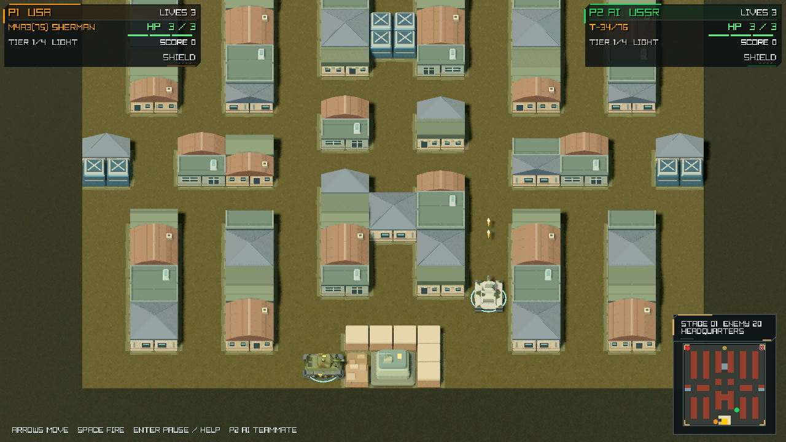
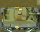
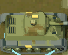

# October 6 Godot preview

Actual Godot Mobile / Metal renders on Apple M5 Pro, with no image retouching.
These images show the current development version. They are not screenshots
of the published Alpha 4 build or approval of a new release. The
[capture manifest](capture-manifest.json) records source and image hashes.

## Gameplay




Window and internal render: 1280×720. Stage 1, seed 20260916, frame 300;
camera yaw 0°, elevation 50°, orthographic span 18.5. P1 follows the
deterministic movement/fire tape; P2 uses the native AI. Demo audio is disabled.
The game simulation is frozen while capturing the two styles.

The images and [state metadata](game/capture.json) are copied byte-for-byte
from the rebuilt app's verified capture. Its world/RNG digest,
`afba842a6ef93d11`, matches a separate run stopped at frame 300. The capture run
continues to frame 360 and reaches the same final state as a run without capture.

Normal play now adapts the internal scene resolution to the window, up to
1920×1080; Pixel Style retains a 1280×720 maximum. This fixed-size diagnostic
uses the same 720p framing as the [September 29 preview](../github-preview-20260929/README.md).
Updated lighting and shadow coverage, armor materials and curved-surface
normals are visible in these renders.

Original-size P1 crops, without enlargement:




Reproduce after `make godot-app`:

```sh
build/Tanks3D-Godot.app/Contents/MacOS/Tanks3D-Godot \
  --rendering-method mobile --rendering-driver metal --resolution 1280x720 \
  -- --demo --stage=1 --seed=20260916 --render-size=1280x720 --frames=360 \
  --capture-at=300 --capture="$PWD/build/godot/new-preview"
```

## Vehicles and menu


Each model uses a 320×272 diagnostic viewport with identical model scale,
camera and lighting; orthographic span 2.60, elevation 29.6°, yaw −145.8°.
This is a close-up comparison. Normal gameplay does not enlarge the tanks to
this size. [Roster metadata](roster.json) records the projected bounds.

```sh
build/godot-tools/Godot.app/Contents/MacOS/Godot \
  --path build/godot/project --rendering-method mobile --rendering-driver metal \
  --script res://art_review.gd -- --review=roster \
  --output="$PWD/build/godot/new-roster.png"
```


Menu: 1280×720, AI P2 and three lives. Capture uses `--demo` to bypass saved
local preferences; these are diagnostic settings, not factory defaults.
Reproduce with the staged engine command above, replacing the script arguments
with `-- --demo --capture-menu --capture="$PWD/build/godot/new-menu"`.

These captures document rendering and framing. Physical controller response,
two-Mac LAN, clean-Mac first launch and sustained performance still require
candidate-specific release acceptance. Historical captures remain intact.
