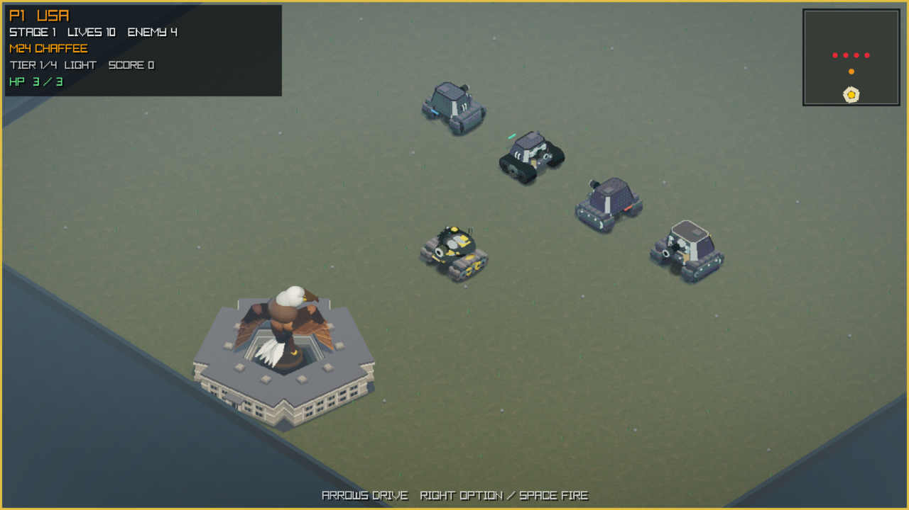
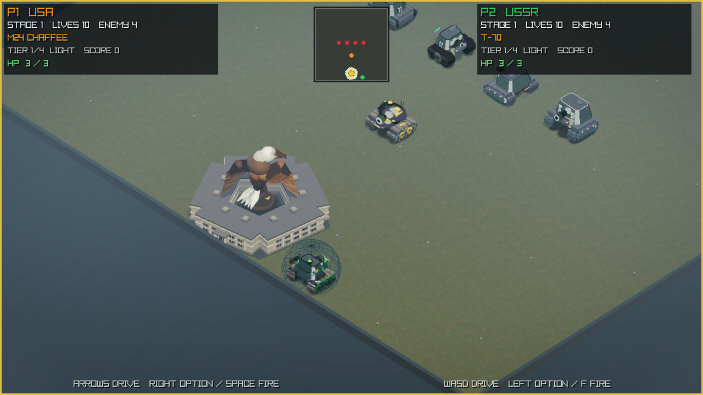
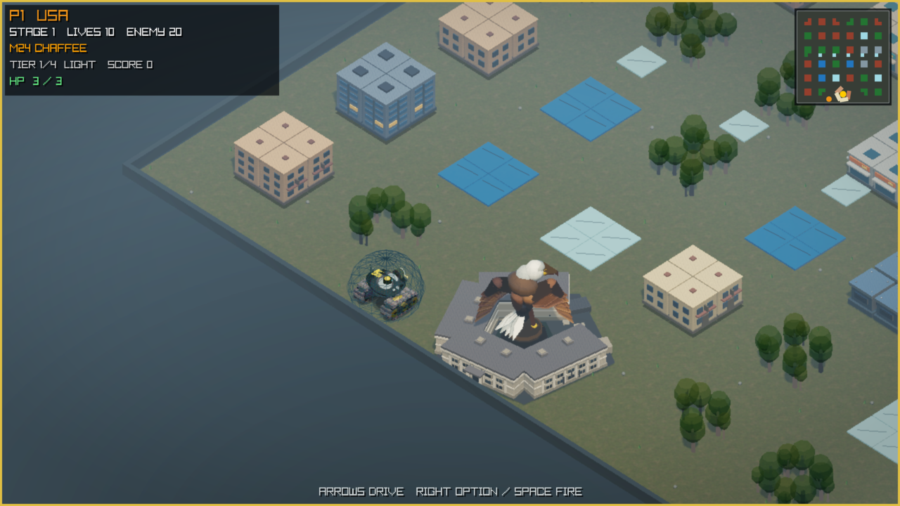
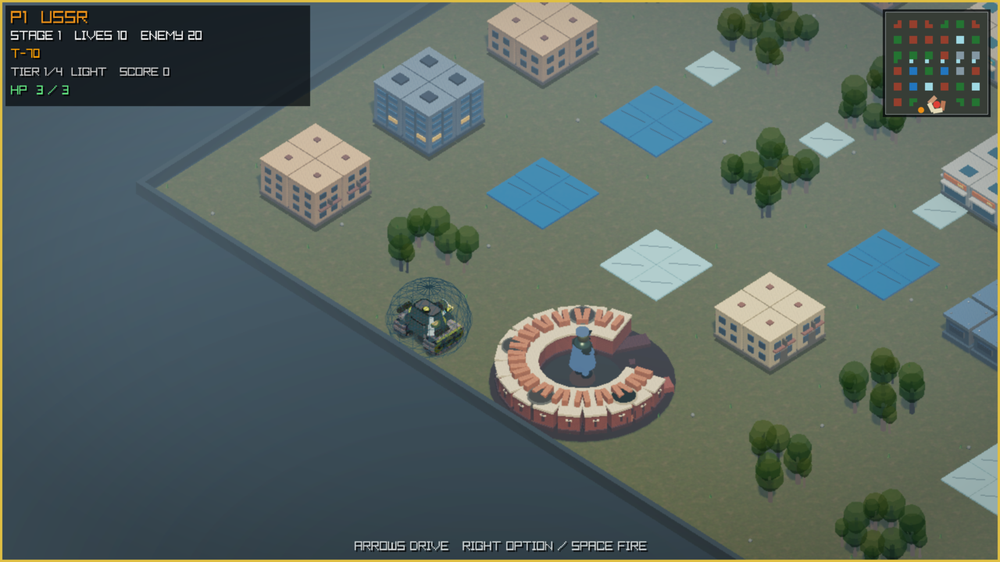
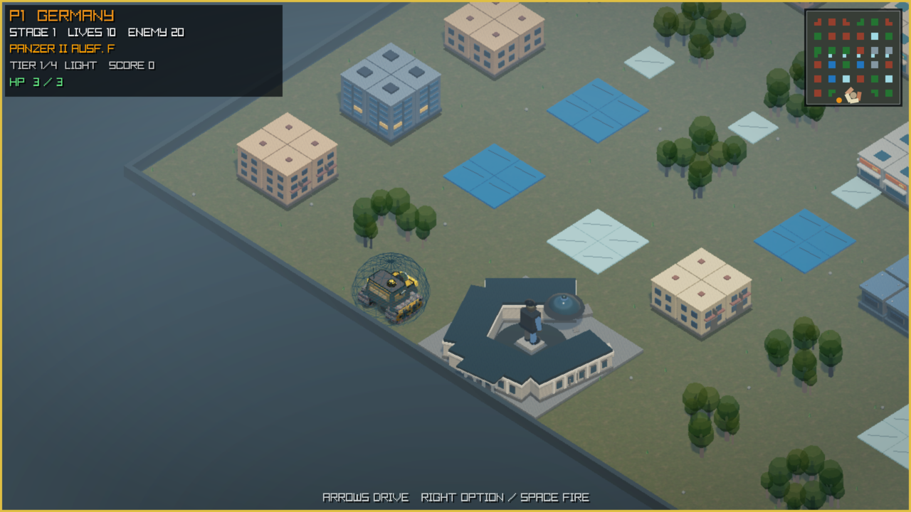
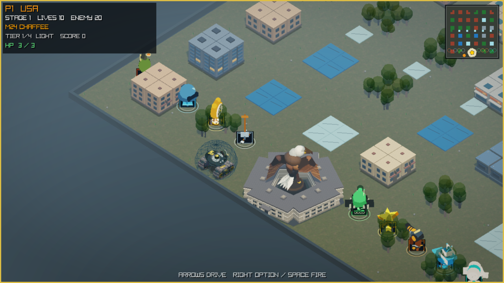
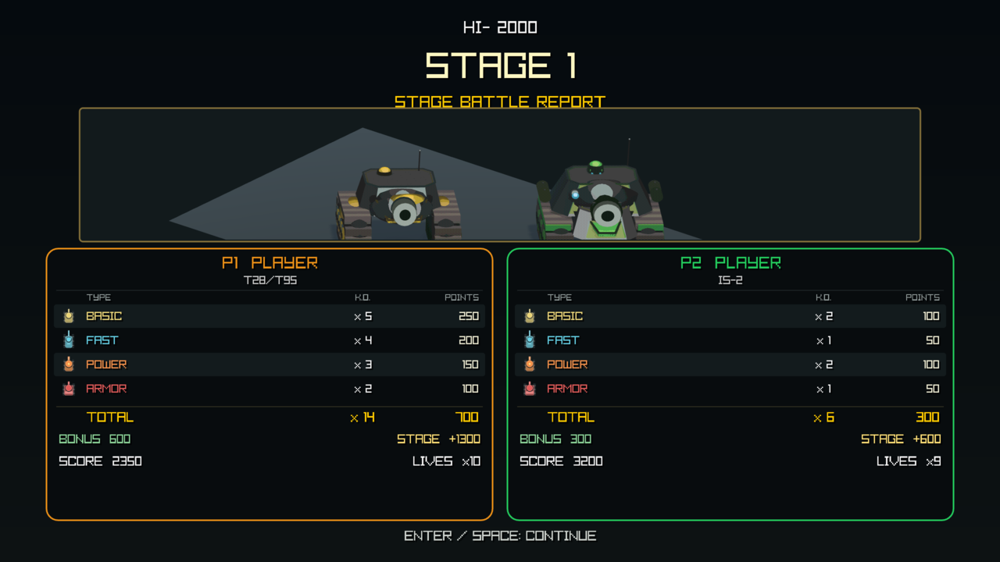

# Tanks 3D v0.1.0-alpha.3

_Classic four-direction tank combat, rebuilt as a fixed-camera isometric 3D
game for Apple Silicon Macs._



> **Release status: BLOCKED.** All eight automated gates and exact-candidate
> visual captures pass. Public release remains blocked on clean-Mac launch testing,
> complete one-/two-player manual QA, a 30-minute session, and the recorded
> inherited-audio decision.

The [machine-readable release status](v0.1.0-alpha.3-status.json) records every
required gate without treating unrun work as passing.

Tanks 3D preserves the readable lanes, destructible defenses, pickups, national
vehicle progression, and base-defense rhythm of classic arcade tank battles.
Movement stays deliberately limited to four directions while the battlefield,
vehicles, buildings, forests, effects, HUD, and objectives are rendered in a
stylized 45-degree 3D view.

## Highlights

- 35 deterministic stages for one player or local shared-camera two-player
  co-op, with a global minimap and local battlefield view.
- Destructible buildings and national objectives, shell-on-shell cancellation,
  3 HP by default, respawning, and direct-fire streaks.
- Nine 3D pickups with blinking classic icons. Bandage appears only when useful;
  Star advances the current tank tier; Shovel temporarily restores steel base
  protection.
- Configurable lives, player HP (1–6), enemy speed, fire frequency, and spawn
  pace. Maximum HP 1 disables Bandage.
- A classified battle report for the four enemy types. Grenade bonus kills are
  excluded from direct-fire K.O. totals.
- The original 2D edition's 22 audio cues, including its stage, Game Over, and
  high-score jingles. That edition has no separate continuous BGM track.



## Three vehicle lines and bases

| Nation | Light | Medium | Heavy | Super-heavy |
| --- | --- | --- | --- | --- |
| United States | M24 Chaffee | M4A3(76)W Sherman | M26 Pershing | T28/T95 |
| Soviet Union | T-70 | T-34-85 | IS-2 | KV-5 Project |
| Germany | Panzer II Ausf. F | Panzer IV Ausf. H | Tiger I Ausf. E | Maus |

Surviving tanks carry their tier into the next stage; destruction resets the
respawning tank to its nation's light Level 0 vehicle. Player 1's nation selects
a Pentagon and eagle, Soviet ring fortress and monument, or German parliament
and monument. The historical imagery is fictionalized period context and does
not express endorsement.

| United States | Soviet Union | Germany |
| --- | --- | --- |
|  |  |  |

## Pickups and settlement





## Controls

| Context | Controls |
| --- | --- |
| Menus | Arrow keys or `WASD` adjust; `Enter` or `Space` confirms |
| Player 1 | Arrow keys move; `Space`, Right Option, or Right Control fires |
| Player 2 | `WASD` moves; `F`, Left Option, or Left Control fires |
| Battle | `Enter` pauses; `Esc` returns to setup; `R` restarts |
| Display/stage | `F8` quality; `F11` borderless; `N`/`B` stage |
| Exit | `Esc` or `Q` from the main setup screen |

## Download and verification

This candidate supports Apple Silicon (`arm64`) and macOS 26.0 or later. It is
self-contained and does not require Homebrew or a separate raylib install.

`Tanks3D-0.1.0-alpha.3-macos-arm64-macos26.0.zip`

```sh
shasum -a 256 -c \
  Tanks3D-0.1.0-alpha.3-macos-arm64-macos26.0.zip.sha256
```

Expected SHA-256:

```text
8b6f6db510535080a6ede1097fd84efed8565c97b58a47307797feb83c718753
```

- Source commit: `1185eb4854cfbb3e6c63e76d0ebd6e36ec527e9e`
- Source tag: `v0.1.0-alpha.3`
- Automated result: 201 suites, 8,442 checks, 16 coverage profiles, all eight
  candidate gates `PASS`

Publish the ZIP together with its checksum, `attestation.txt`,
`alpha-candidate-gates.log`, and `build-config.txt`.

## Alpha limitations

The app is ad-hoc signed for bundle-integrity checking, not Developer ID signed
or notarized. Gatekeeper behavior for a quarantined download is not yet
documented. Hardware audio, a complete gameplay matrix, and long-session
performance also await signed manual QA; see
[`v0.1.0-alpha.3-qa.md`](v0.1.0-alpha.3-qa.md).

## Author and licensing

Author identity is recorded as **tourzhao**; the required notice is
`Copyright (c) 2026 tourzhao.` Project-owned code and assets use the
[PolyForm Noncommercial License 1.0.0](../../LICENSE): sharing and modification
for permitted non-commercial purposes are allowed, but commercial use is not
granted. This is source-available software, not OSI open source.

Third-party MIT, zlib, and CC0 components retain their original terms. See
[`NOTICE`](../../NOTICE), [`THIRD_PARTY_NOTICES.md`](../../THIRD_PARTY_NOTICES.md),
and [`ASSET_LICENSES.md`](../../ASSET_LICENSES.md). This independent fan project
is not affiliated with or endorsed by any publisher, manufacturer, government,
or other rights holder, and no included license grants third-party trademark,
publicity, or character/IP rights.
