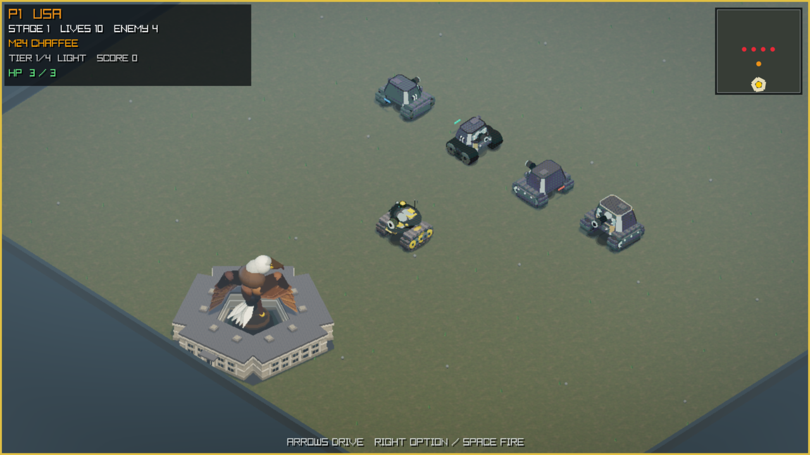
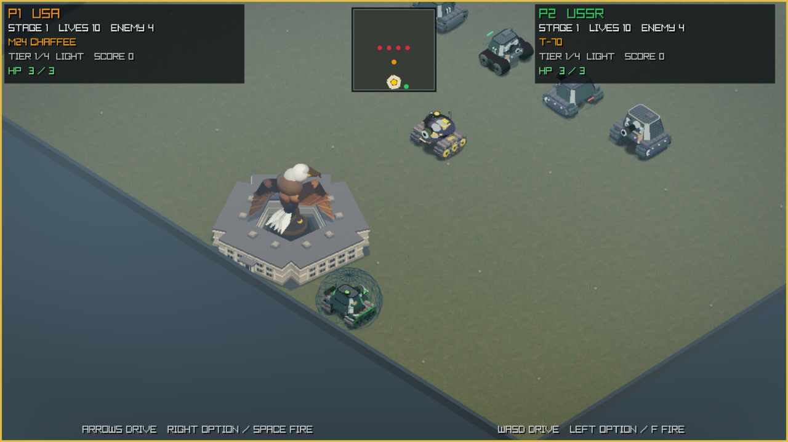
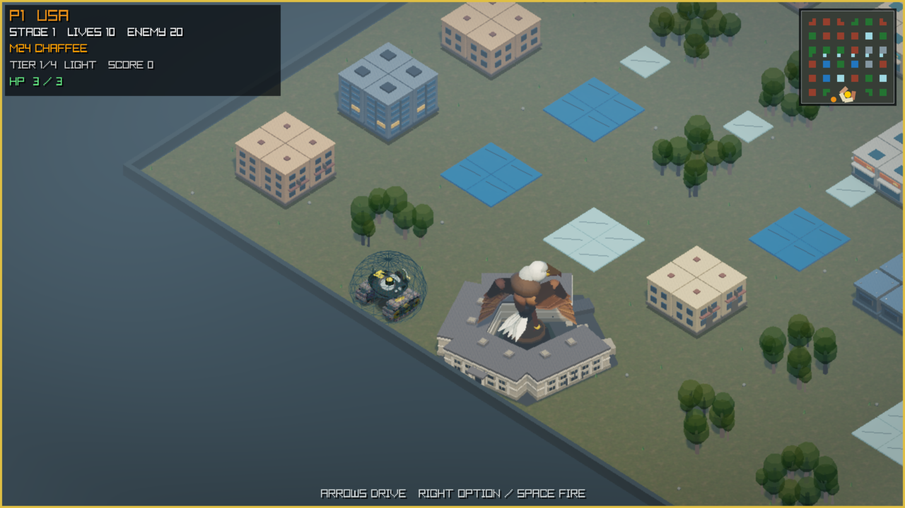
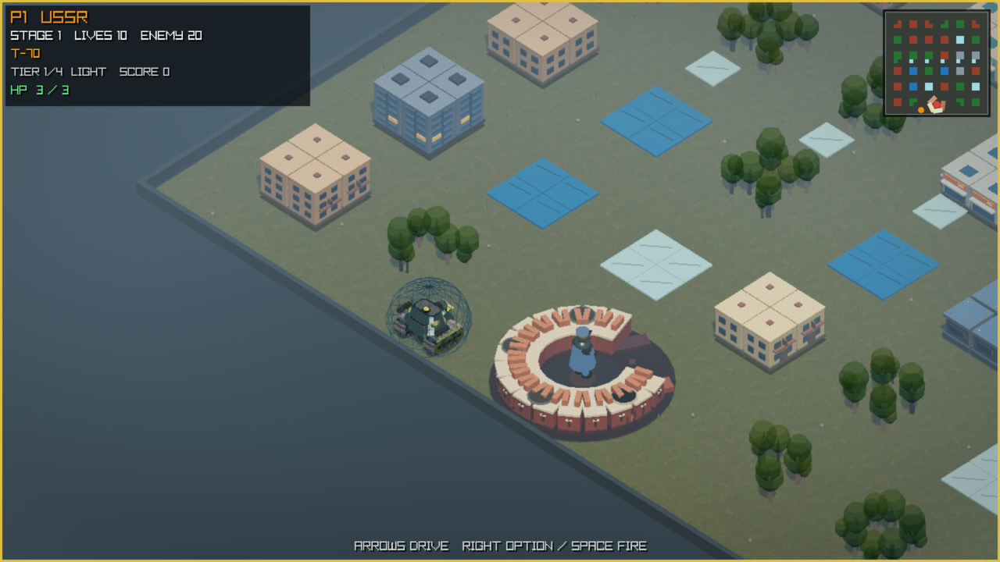
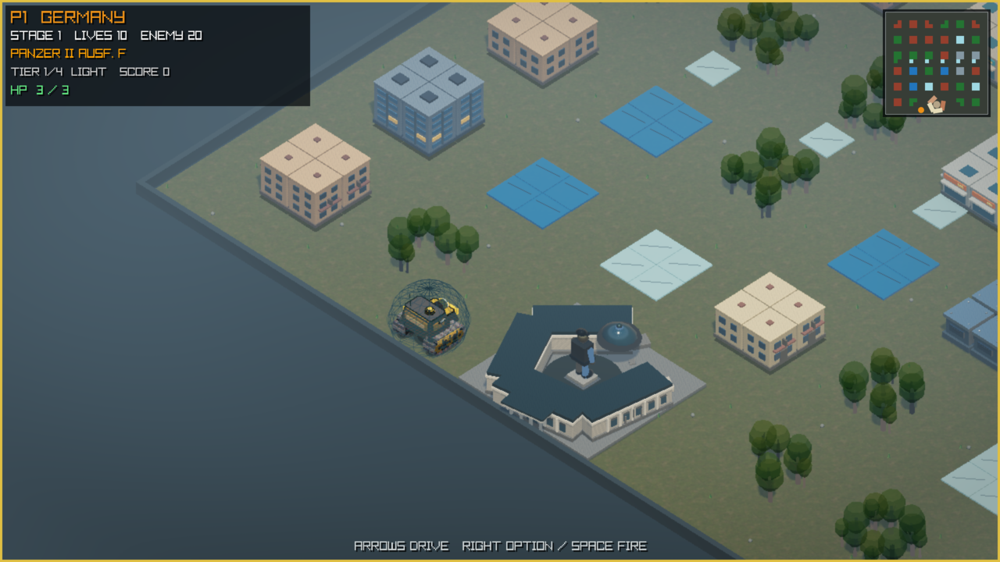
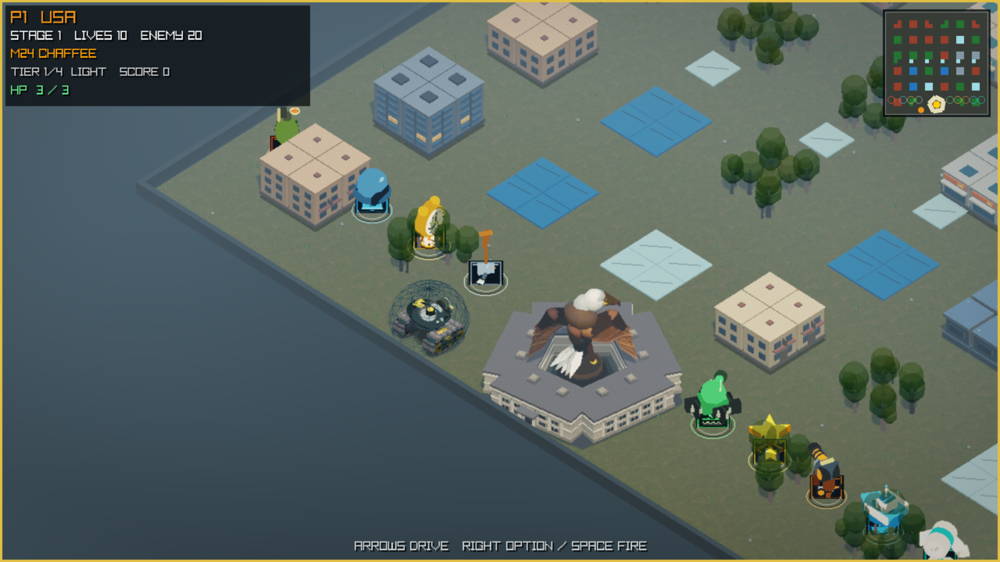
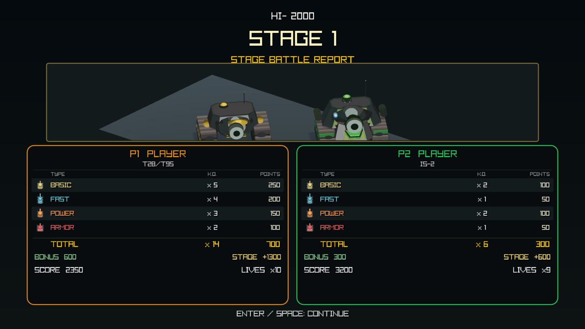

# Tanks 3D v0.1.0-alpha.4

_Classic four-direction tank combat in a fixed-camera isometric 3D battlefield._



> **Release status: BLOCKED.** This candidate-specific draft is not approved
> for publication. The images and automated candidate are bound below, while
> clean-Mac, interactive, performance, audio-risk, and approval gates remain.

See the [v0.1.0-alpha.4 QA report](v0.1.0-alpha.4-qa.md) and
[v0.1.0-alpha.4 machine-readable status](v0.1.0-alpha.4-status.json).

## Game overview

Tanks 3D is a non-commercial, isometric arcade tank game for Apple Silicon
macOS. It keeps four-direction movement, destructible defenses, opposing-shell
cancellation, local two-player co-op, national vehicle progression, 3D pickups,
a minimap, configurable HP and difficulty, and a classified end-stage report.

- 35 deterministic stages with one-player and shared-camera two-player modes.
- United States, Soviet, and German light-to-super-heavy vehicle lines.
- Destructible national objectives, temporary Shovel steel, HP/respawn, and
  direct-fire streaks.
- Nine pickups, including conditional Bandage healing and Star upgrades.
- Fixed 45-degree local camera plus a global minimap.



## National bases

| United States | Soviet Union | Germany |
| --- | --- | --- |
|  |  |  |

## Pickups and settlement





## Controls

| Context | Controls |
| --- | --- |
| Menus | Arrow keys or `WASD`; `Enter` or `Space` confirms |
| Player 1 | Arrow keys move; `Space`, Right Option, or Right Control fires |
| Player 2 | `WASD` moves; `F`, Left Option, or Left Control fires |
| Battle | `Enter` pauses; `Esc` returns to setup; `R` restarts |
| Display/stage | `F8` quality; `F11` borderless; `N`/`B` stage |
| Exit | `Esc` or `Q` from the setup screen |

Controls remain unapproved until the linked exact-candidate matrix is signed.

## Candidate identity

- Release date: NOT RECORDED — BLOCKED
- Artifact: `Tanks3D-0.1.0-alpha.4-macos-arm64-macos26.0.zip`
- SHA-256: `9a4826b6e5809fceed65d0c227ffad35751ee87c160c2758412c05d8dc875e0b`
- Source commit: `a6dc49ab013cfa827946e52660737b8dcb7aa8e1`
- Source tag: `v0.1.0-alpha.4`
- Architecture/minimum OS: `arm64` / macOS `26.0`
- Signing: ad-hoc integrity signature; not Developer ID signed or notarized

Publish the ZIP only with its checksum, `attestation.txt`,
`alpha-candidate-gates.log`, and `build-config.txt`, after the final no-exception
release gate passes.

After downloading, verify the exact artifact before opening it:

```sh
shasum -a 256 Tanks3D-0.1.0-alpha.4-macos-arm64-macos26.0.zip
```

The result must equal `9a4826b6e5809fceed65d0c227ffad35751ee87c160c2758412c05d8dc875e0b`.

## Release gate summary

| Gate | Status |
| --- | --- |
| Gameplay matrix | BLOCKED |
| National bases | BLOCKED |
| Pickups | BLOCKED |
| Settlement | BLOCKED |
| Published controls | BLOCKED |
| Clean Mac | BLOCKED |
| Gatekeeper | BLOCKED |
| Extended session | BLOCKED |
| Evidence manifest | BLOCKED |
| Known issues | BLOCKED |
| Audio decision | BLOCKED |
| QA approval | BLOCKED |
| Release-owner approval | BLOCKED |

Gatekeeper conclusion: **BLOCKED**

Known-issues review: **NONE — BLOCKED**

Audio decision: **NONE — BLOCKED**

## Alpha limitations and licensing

This draft remains blocked until quarantined-download Gatekeeper behavior,
one-/two-player QA, hardware audio, a 30-minute performance session, known
issues, and independent approvals are recorded. Project-owned code and assets
use the [PolyForm Noncommercial License 1.0.0](../../LICENSE); commercial use of
those portions is not licensed. The exact project notice is in
[`NOTICE`](../../NOTICE). Third-party materials are not relicensed under
PolyForm: the release statically links raylib 6.0 and its embedded dependencies,
and their terms are shipped under [`LICENSES/`](../../LICENSES/) and summarized
in [`THIRD_PARTY_NOTICES.md`](../../THIRD_PARTY_NOTICES.md). Asset provenance is
recorded in [`ASSET_LICENSES.md`](../../ASSET_LICENSES.md). Those third-party
terms may grant rights independently of PolyForm. No included license grants
trademark, character, publicity, or other third-party IP rights; this is an
independent, unaffiliated fan project.

## Author

Author: **tourzhao**

Required notice: `Required Notice: Copyright (c) 2026 tourzhao.`
