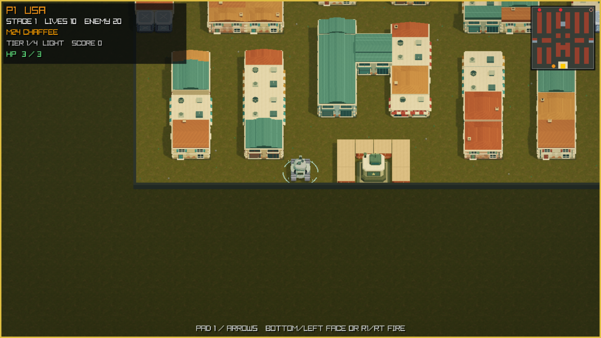
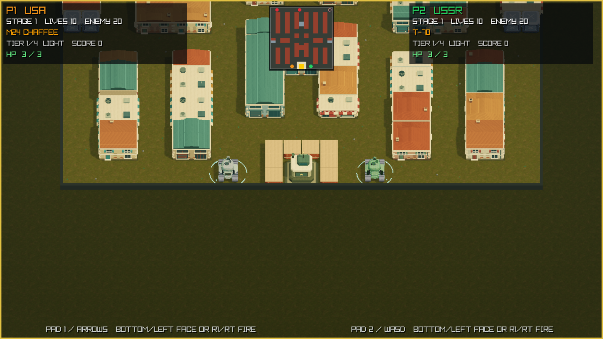
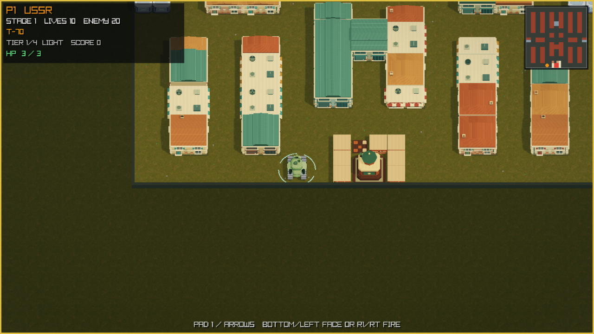
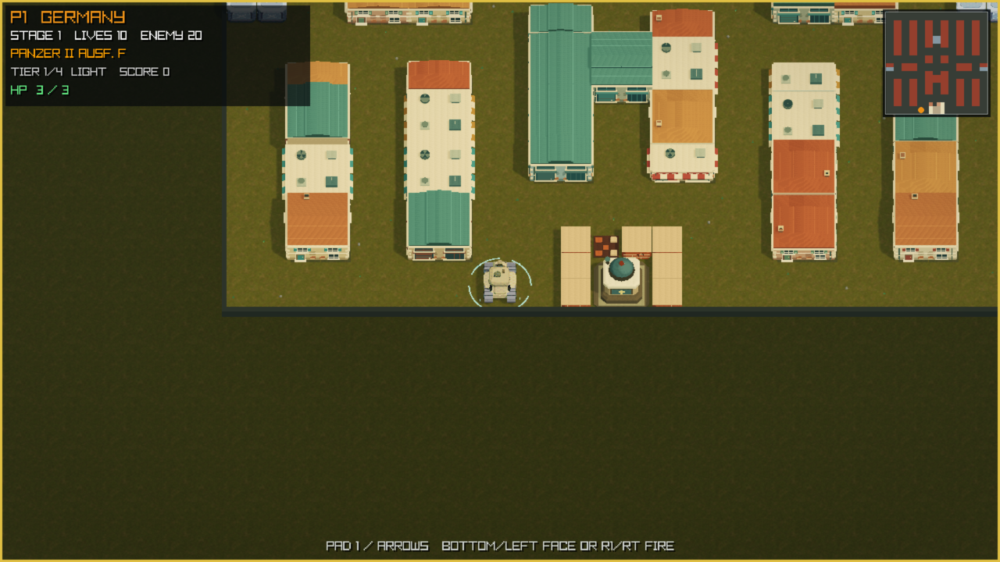
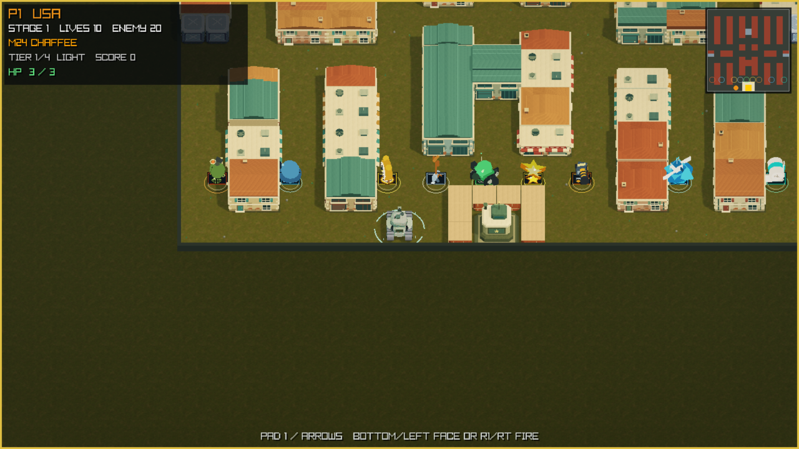
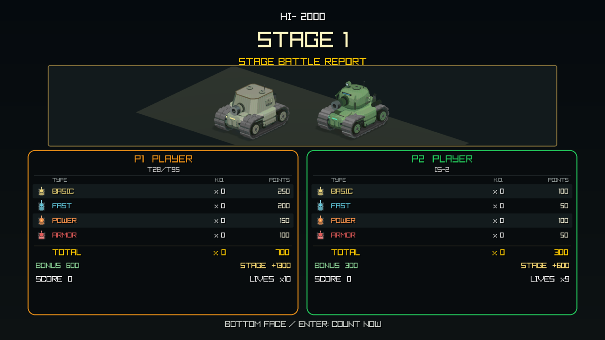

# Tanks 3D v0.1.0-alpha.5 Alpha QA Report

> **Overall Alpha gate: BLOCKED.** This baseline records no human PASS
> result. Replace NOT RUN only with exact-candidate evidence and accountable
> signatures, then pass the no-exception verifier before publication.

## Candidate identity

| Field | Value |
| --- | --- |
| Tag | `v0.1.0-alpha.5` |
| Planned release date | NOT RECORDED — BLOCKED |
| Source commit | `cc5f2a7eec073accf37c2085c10bf155061acef2` |
| Candidate directory | `build/release/v0.1.0-alpha.5` |
| Artifact | `Tanks3D-0.1.0-alpha.5-macos-arm64-macos26.0.zip` |
| Artifact SHA-256 | `d82b1ca75e6b9503fdfbe84baf32f2f7a6e3ea7a042d8a7a438cb7be501e59d8` |
| Checksum | `Tanks3D-0.1.0-alpha.5-macos-arm64-macos26.0.zip.sha256` / `0e551aa40f43337152394cc593d8e51ace82d4b46dfc26d3ca56a45b55b81f7d` |
| Attestation | `attestation.txt` / `42669736efa41566ada742bf137431e1afecebf9b5e2aa055c465f38ed943aa2` |
| Gate log | `alpha-candidate-gates.log` / `1c329c8e65d591bd9a9049658cdb386a3bd8a327e42f18d9135528944fdaca60` |
| Build config | `build-config.txt` / `8fdb8ace9df0819898a8e463b23a015b2ebdb7b962ee6f8c0a43c8c6cc53b58c` |

## Publication images

All seven images were exported from the unchanged candidate ZIP and inspected
by the development agent. The HUD is legible and the expected national bases,
pickups and settlement are present. The spawn views include substantial ground
outside the map below the players. Independent framing and interactive review
remain NOT RUN.

One-/two-player images show the stage-1 spawn. Base images use the damaged-wall
showcase; pickup and settlement images also use built-in staged showcases.
They do not establish actual controller play, damage, pickups or stage clears.

The [capture record](../../build/release-evidence/v0.1.0-alpha.5/screenshot-capture-record.json)
binds their commands and hashes to the exact candidate.

## Automated verification and remaining feature checks

All eight candidate build gates passed: 209 Python release-tool tests,
247 game suites / 15,700 runtime checks, 26 ASan/UBSan suites / 14,166 checks,
strict compilation, architecture, coverage and exact distribution checks.
The candidate's attestation and gate log above contain the full results.

The [unsigned audio inventory](../../build/release-evidence/v0.1.0-alpha.5/audio-review/review.md)
confirms all 22 OGG files and four canonical notices match the tagged source.
Listening and the audio-owner decision remain pending.

The fixed v2 matrix below predates Pixel Style and enemy-nation selection.
Their additional acceptance checks, real Bluetooth tests, and long-session
instructions are in the
[Chinese operator checklist](../../build/release-evidence/release-hardening-20260909/OPERATOR_CHECKLIST.zh-CN.md).
These additional feature checks remain NOT RUN. All automated work here is
release preparation; human identities, observations and signatures remain empty.

## Publication image review matrix

| Image | SHA-256 | Review |
| --- | --- | --- |
|  | `a6d3a0a6a7302e6b9d804154c24818d52132be06c3bb5d0ba6f590781adaa834` | NOT RUN |
|  | `c58d45f1f6b934e2043f72f6bb10b5860e45f2a77dea0fec4a63ab1b50dc40ce` | NOT RUN |
|  | `00336fc22b1773ac91b08b5b568239922b2e59edc23af9470d904ffcd012b853` | NOT RUN |
|  | `95f52272b6bae5596b8d4d0c05c7a5313ffaeee14a855729e5ca6738acc3c801` | NOT RUN |
|  | `a903da9bd6187015ae1016b34d5c8701a5b43d5fcfdd90b854e49baeb288ac6b` | NOT RUN |
|  | `06ff40a1b0ed42f4e2127cbd5d4c2f673d778d8a33d3439b504c396dd3606de0` | NOT RUN |
|  | `d941f9998cad308a52e88ab67050f1fc92f6c389a67efcadaf3328ccf098c885` | NOT RUN |

## One-player and two-player gameplay matrix

| Scenario ID | One player | Two players |
| --- | --- | --- |
| `start_and_control` | NOT RUN | NOT RUN |
| `movement_and_collision` | NOT RUN | NOT RUN |
| `fire_hits_and_shell_cancellation` | NOT RUN | NOT RUN |
| `pause_and_resume` | NOT RUN | NOT RUN |
| `escape_returns_to_setup` | NOT RUN | NOT RUN |
| `hp_death_and_respawn` | NOT RUN | NOT RUN |
| `streak_increment_and_reset` | NOT RUN | NOT RUN |
| `base_breach_and_core_loss` | NOT RUN | NOT RUN |
| `classified_ko_rows_and_totals` | NOT RUN | NOT RUN |
| `grenade_excluded_from_direct_ko` | NOT RUN | NOT RUN |
| `settlement_transition` | NOT RUN | NOT RUN |
| `fullscreen_toggle` | NOT RUN | NOT RUN |
| `resize_hud_camera_and_minimap` | NOT RUN | NOT RUN |
| `audio_cues_and_volume` | NOT RUN | NOT RUN |
| `complete_stage_stability` | NOT RUN | NOT RUN |

## National bases

Every base must cover wall damage/breach, Shovel material and protection,
collision, core loss, visibility, and emblem orientation in both modes.

| Base ID | One player | Two players |
| --- | --- | --- |
| `usa` | NOT RUN | NOT RUN |
| `ussr` | NOT RUN | NOT RUN |
| `germany` | NOT RUN | NOT RUN |

## Pickups

| Pickup/check ID | One player | Two players |
| --- | --- | --- |
| `grenade` | NOT RUN | NOT RUN |
| `helmet` | NOT RUN | NOT RUN |
| `clock` | NOT RUN | NOT RUN |
| `shovel` | NOT RUN | NOT RUN |
| `tank` | NOT RUN | NOT RUN |
| `star` | NOT RUN | NOT RUN |
| `gun` | NOT RUN | NOT RUN |
| `boat` | NOT RUN | NOT RUN |
| `bandage_heal` | NOT RUN | NOT RUN |
| `bandage_absent_at_full_hp` | NOT RUN | NOT RUN |
| `bandage_disabled_at_max_hp_1` | NOT RUN | NOT RUN |
| `pickup_lifetime_12_5_seconds` | NOT RUN | NOT RUN |

## Settlement and controls

| Settlement ID | Result |
| --- | --- |
| `basic_tank_ko` | NOT RUN |
| `fast_tank_ko` | NOT RUN |
| `power_tank_ko` | NOT RUN |
| `armor_tank_ko` | NOT RUN |
| `ko_total` | NOT RUN |
| `score_points` | NOT RUN |
| `grenade_exclusion` | NOT RUN |

Published control bindings and advanced settings: **NOT RUN — BLOCKED**.

## Published controls and advanced settings

Control contract revision: `camera-controller-v1`.
Every row below requires observation in its named context and a
candidate-bound recording; a passing automated test or screenshot
does not complete the row. Follow the camera/controller procedure in
[the QA worksheet](../ALPHA_QA_REPORT_TEMPLATE.md#camera-and-controller-procedure).

| Context | Required check | Result | Evidence / notes |
| --- | --- | --- | --- |
| `main_menu` | `menu_arrow_or_wasd_navigation` | NOT RUN | |
| `main_menu` | `menu_enter_or_space_confirm` | NOT RUN | |
| `main_menu` | `q_or_escape_exits_from_setup` | NOT RUN | |
| `main_menu` | `controller_menu_navigation_confirm_cancel_reset` | NOT RUN | |
| `main_menu` | `controller_disconnect_reconnect_without_stuck_input` | NOT RUN | |
| `main_menu` | `default_hp_3_and_reset_restores_defaults` | NOT RUN | |
| `main_menu` | `player_hp_range_1_to_6_step_1` | NOT RUN | |
| `main_menu` | `enemy_speed_range_minus_30_to_plus_30_step_5` | NOT RUN | |
| `main_menu` | `fire_frequency_range_minus_30_to_plus_30_step_5` | NOT RUN | |
| `main_menu` | `spawn_pace_range_minus_30_to_plus_30_step_5` | NOT RUN | |
| `main_menu` | `escape_preserves_selected_values` | NOT RUN | |
| `main_menu` | `camera_yaw_range_minus_45_to_plus_45_step_5` | NOT RUN | |
| `main_menu` | `camera_elevation_range_40_to_70_step_5` | NOT RUN | |
| `main_menu` | `camera_defaults_yaw_0_elevation_50_and_reset` | NOT RUN | |
| `main_menu` | `camera_angles_preserved_on_escape_start_restart` | NOT RUN | |
| `one_player` | `player_1_arrow_movement` | NOT RUN | |
| `one_player` | `player_1_fire_bindings` | NOT RUN | |
| `one_player` | `enter_pause_resume` | NOT RUN | |
| `one_player` | `escape_returns_to_setup` | NOT RUN | |
| `one_player` | `r_restarts_stage` | NOT RUN | |
| `one_player` | `f8_quality_toggle` | NOT RUN | |
| `one_player` | `f11_borderless_toggle` | NOT RUN | |
| `one_player` | `n_b_stage_navigation` | NOT RUN | |
| `one_player` | `controller_fire_pause_cancel_no_face_exit` | NOT RUN | |
| `one_player` | `controller_stable_player_assignments` | NOT RUN | |
| `one_player` | `controller_disconnect_reconnect_without_stuck_input` | NOT RUN | |
| `one_player` | `camera_relative_stick_all_yaw_steps_and_cardinal_keyboard_dpad` | NOT RUN | |
| `one_player` | `return_menu_held_stick_release_without_dpad` | NOT RUN | |
| `one_player` | `return_menu_held_stick_release_with_dpad_overlap` | NOT RUN | |
| `one_player` | `selected_tuning_applies_after_start_and_restart` | NOT RUN | |
| `one_player` | `hp_1_disables_bandage_and_normal_hp_restores_it` | NOT RUN | |
| `one_player` | `camera_angles_preserved_on_escape_start_restart` | NOT RUN | |
| `one_player` | `camera_framing_all_angles_and_window_sizes` | NOT RUN | |
| `one_player` | `solo_camera_continuous_follow_and_reset` | NOT RUN | |
| `two_player` | `player_1_arrow_movement` | NOT RUN | |
| `two_player` | `player_1_fire_bindings` | NOT RUN | |
| `two_player` | `player_2_wasd_movement` | NOT RUN | |
| `two_player` | `player_2_fire_bindings` | NOT RUN | |
| `two_player` | `enter_pause_resume` | NOT RUN | |
| `two_player` | `escape_returns_to_setup` | NOT RUN | |
| `two_player` | `r_restarts_stage` | NOT RUN | |
| `two_player` | `f8_quality_toggle` | NOT RUN | |
| `two_player` | `f11_borderless_toggle` | NOT RUN | |
| `two_player` | `n_b_stage_navigation` | NOT RUN | |
| `two_player` | `controller_fire_pause_cancel_no_face_exit` | NOT RUN | |
| `two_player` | `controller_stable_player_assignments` | NOT RUN | |
| `two_player` | `controller_disconnect_reconnect_without_stuck_input` | NOT RUN | |
| `two_player` | `camera_relative_stick_all_yaw_steps_and_cardinal_keyboard_dpad` | NOT RUN | |
| `two_player` | `return_menu_held_stick_release_without_dpad` | NOT RUN | |
| `two_player` | `return_menu_held_stick_release_with_dpad_overlap` | NOT RUN | |
| `two_player` | `selected_tuning_applies_after_start_and_restart` | NOT RUN | |
| `two_player` | `hp_1_disables_bandage_and_normal_hp_restores_it` | NOT RUN | |
| `two_player` | `camera_angles_preserved_on_escape_start_restart` | NOT RUN | |
| `two_player` | `camera_framing_all_angles_and_window_sizes` | NOT RUN | |
| `two_player` | `coop_camera_midpoint_separation_and_respawn` | NOT RUN | |

## Clean Mac, Gatekeeper, and extended session

- Clean Apple-Silicon Mac downloaded-artifact test: NOT RUN — BLOCKED
- Quarantine/Gatekeeper first launch: NOT RUN — BLOCKED
- Gatekeeper conclusion: **BLOCKED**
- Candidate-generated 30-minute performance run: NOT RUN — BLOCKED
- Hardware audio review: NOT RUN — BLOCKED

The performance run must meet the v2 thresholds, remain focused and in
active gameplay for the required ratios, and clear at least one stage.

## Release gate summary

| Gate | Status |
| --- | --- |
| Gameplay matrix | BLOCKED |
| National bases | BLOCKED |
| Pickups | BLOCKED |
| Settlement | BLOCKED |
| Published controls | BLOCKED |
| Clean Mac | BLOCKED |
| Gatekeeper | BLOCKED |
| Extended session | BLOCKED |
| Evidence manifest | BLOCKED |
| Known issues | BLOCKED |
| Audio decision | BLOCKED |
| QA approval | BLOCKED |
| Release-owner approval | BLOCKED |

## Decisions and approval

- Known-issues review: **NONE — BLOCKED**
- Selected option: **NONE — BLOCKED**
- Inherited 22-sound decision: **NONE — BLOCKED**
- QA lead: NOT SIGNED — BLOCKED
- Release owner: NOT SIGNED — BLOCKED

After completing and signing the structured evidence, update this report
and the release page together, recompute their hashes in the status JSON,
and run `make verify-alpha-release-ready DIST_CHANNEL=alpha.5`.
